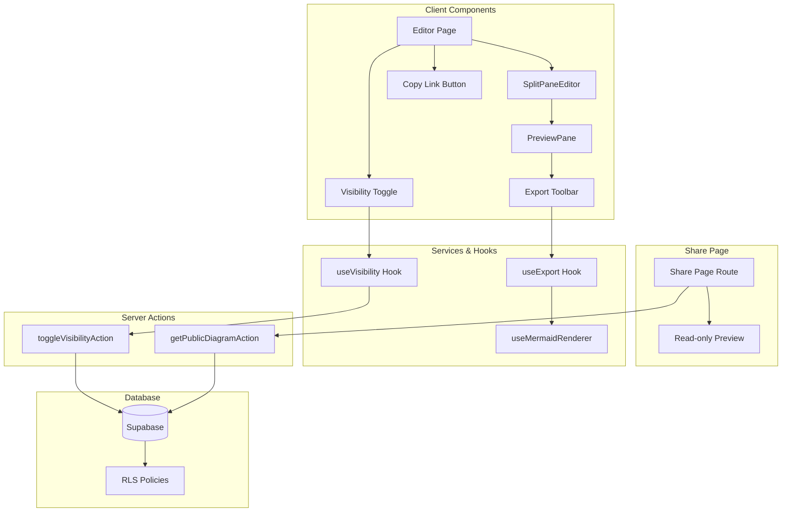

# Design Document: Diagram Sharing & Export

## Overview

This design document describes the technical implementation for adding export to image functionality (PNG/SVG) and publish/private visibility controls for Mermaid diagrams. The feature integrates with the existing split-pane editor architecture and extends the database schema to support public diagram sharing.

The implementation follows the existing feature-based architecture pattern established in `src/features/editor/` and leverages the current Supabase RLS policies with extensions for public access.

## Architecture

### High-Level Architecture



### Component Integration

The export functionality integrates into the existing `PreviewPane` component by adding an export toolbar. The visibility controls are added to the diagram editor page header alongside the existing save status indicator.

## Components and Interfaces

### New Components

#### 1. ExportToolbar Component

Location: `src/features/editor/components/export-toolbar.tsx`

```typescript
interface ExportToolbarProps {
  /** Current SVG string from mermaid renderer */
  svg: string | null;
  /** Whether there's a rendering error */
  hasError: boolean;
  /** Diagram name for filename */
  diagramName: string;
}

function ExportToolbar({
  svg,
  hasError,
  diagramName,
}: ExportToolbarProps): JSX.Element;
```

Responsibilities:

- Render PNG and SVG export buttons
- Disable buttons when `hasError` is true or `svg` is null
- Trigger export via `useExport` hook

#### 2. VisibilityToggle Component

Location: `src/features/sharing/components/visibility-toggle.tsx`

```typescript
interface VisibilityToggleProps {
  /** Current visibility state */
  isPublic: boolean;
  /** Callback when visibility changes */
  onToggle: (isPublic: boolean) => void;
  /** Whether toggle is disabled (during save) */
  disabled?: boolean;
}

function VisibilityToggle({
  isPublic,
  onToggle,
  disabled,
}: VisibilityToggleProps): JSX.Element;
```

Responsibilities:

- Display current visibility state with icon (Lock/Globe)
- Toggle between public/private states
- Show loading state during save

#### 3. CopyLinkButton Component

Location: `src/features/sharing/components/copy-link-button.tsx`

```typescript
interface CopyLinkButtonProps {
  /** Diagram ID for generating share URL */
  diagramId: string;
  /** Whether the diagram is public */
  isPublic: boolean;
}

function CopyLinkButton({
  diagramId,
  isPublic,
}: CopyLinkButtonProps): JSX.Element;
```

Responsibilities:

- Render "Copy Link" button only when `isPublic` is true
- Copy share URL to clipboard on click
- Show success toast on copy

#### 4. SharePage Component

Location: `src/app/share/[diagramId]/page.tsx`

```typescript
interface SharePageProps {
  params: { diagramId: string };
}

async function SharePage({ params }: SharePageProps): Promise<JSX.Element>;
```

Responsibilities:

- Fetch public diagram data (server component)
- Render diagram in read-only mode
- Display error state for private/non-existent diagrams

### New Hooks

#### 1. useExport Hook

Location: `src/features/editor/hooks/use-export.ts`

```typescript
interface UseExportOptions {
  /** SVG string to export */
  svg: string | null;
  /** Filename without extension */
  filename: string;
}

interface UseExportResult {
  /** Export as PNG */
  exportPng: () => Promise<void>;
  /** Export as SVG */
  exportSvg: () => void;
  /** Whether PNG export is in progress */
  isExporting: boolean;
}

function useExport(options: UseExportOptions): UseExportResult;
```

Implementation details:

- PNG export uses `html-to-image` library to convert SVG to PNG
- SVG export creates a Blob from the raw SVG string
- Both trigger browser download via temporary anchor element

#### 2. useVisibility Hook

Location: `src/features/sharing/hooks/use-visibility.ts`

```typescript
interface UseVisibilityOptions {
  /** Initial visibility state */
  initialIsPublic: boolean;
  /** Diagram ID */
  diagramId: string;
}

interface UseVisibilityResult {
  /** Current visibility state */
  isPublic: boolean;
  /** Toggle visibility */
  toggleVisibility: () => void;
  /** Whether save is in progress */
  isSaving: boolean;
  /** Error message if save failed */
  error: string | null;
}

function useVisibility(options: UseVisibilityOptions): UseVisibilityResult;
```

### Server Actions

#### 1. toggleVisibilityAction

Location: `src/features/sharing/actions/visibility.actions.ts`

```typescript
const toggleVisibilitySchema = z.object({
  diagramId: z.string().uuid(),
  isPublic: z.boolean(),
});

export const toggleVisibilityAction = authActionClient
  .schema(toggleVisibilitySchema)
  .action(async ({ parsedInput, ctx }) => {
    // Update diagram visibility in database
    // Return success/error
  });
```

#### 2. getPublicDiagramAction

Location: `src/features/sharing/actions/share.actions.ts`

```typescript
const getPublicDiagramSchema = z.object({
  diagramId: z.string().uuid(),
});

// Note: This action does NOT use authActionClient - it's public
export const getPublicDiagramAction = actionClient
  .schema(getPublicDiagramSchema)
  .action(async ({ parsedInput }) => {
    // Fetch diagram if public
    // Return diagram data or not found error
  });
```

## Data Models

### Database Schema Changes

New migration: `supabase/migrations/002_add_diagram_visibility.sql`

```sql
-- Add is_public column to diagrams table
ALTER TABLE diagrams
ADD COLUMN is_public BOOLEAN NOT NULL DEFAULT false;

-- Create index for public diagram queries
CREATE INDEX idx_diagrams_is_public ON diagrams(is_public) WHERE is_public = true;

-- Add RLS policy for public diagram viewing
CREATE POLICY "Anyone can view public diagrams" ON diagrams
  FOR SELECT USING (is_public = true);
```

### TypeScript Type Updates

Update `src/types/database.ts`:

```typescript
export interface Diagram {
  id: string;
  project_id: string;
  name: string;
  code: string;
  is_public: boolean; // New field
  created_at: string;
  updated_at: string;
}
```

### Export Types

Location: `src/features/editor/types/export.types.ts`

```typescript
export type ExportFormat = 'png' | 'svg';

export interface ExportOptions {
  format: ExportFormat;
  filename: string;
  svg: string;
}
```

### Sharing Types

Location: `src/features/sharing/types/sharing.types.ts`

```typescript
export interface PublicDiagram {
  id: string;
  name: string;
  code: string;
}

export interface ShareUrlParams {
  diagramId: string;
}
```

## Correctness Properties

_A property is a characteristic or behavior that should hold true across all valid executions of a system—essentially, a formal statement about what the system should do. Properties serve as the bridge between human-readable specifications and machine-verifiable correctness guarantees._

### Property 1: PNG Export Produces Valid Output

_For any_ valid Mermaid diagram that renders successfully to SVG, exporting to PNG SHALL produce a non-empty, valid PNG image.

**Validates: Requirements 1.1**

### Property 2: SVG Export Round-Trip

_For any_ valid Mermaid diagram, the exported SVG file content SHALL equal the raw SVG string from the Mermaid renderer.

**Validates: Requirements 2.4**

### Property 3: Export Filename Format

_For any_ diagram name and export format (PNG or SVG), the exported filename SHALL follow the pattern `{sanitized-diagram-name}.{format}` where the diagram name is sanitized for filesystem compatibility.

**Validates: Requirements 1.2, 2.2**

### Property 4: Export Buttons Disabled on Error

_For any_ diagram with a rendering error (hasError = true), both PNG and SVG export buttons SHALL be disabled.

**Validates: Requirements 1.3, 2.3**

### Property 5: Visibility Toggle Persistence

_For any_ diagram, toggling the visibility setting SHALL result in the `is_public` field in the database matching the new visibility state.

**Validates: Requirements 3.2, 3.6**

### Property 6: Private Diagram Access Control

_For any_ private diagram (is_public = false), only the owner SHALL be able to read the diagram data; all other users (including unauthenticated) SHALL receive an access denied or not found response.

**Validates: Requirements 3.3, 6.3**

### Property 7: Public Diagram Accessibility

_For any_ public diagram (is_public = true), any user (including unauthenticated) SHALL be able to read the diagram data via the share endpoint.

**Validates: Requirements 3.4, 5.1, 5.3, 6.2**

### Property 8: Copy Link Button Visibility

_For any_ diagram, the Copy Link button SHALL be visible if and only if the diagram's `is_public` field is true.

**Validates: Requirements 4.1, 4.4**

### Property 9: Share URL Format

_For any_ diagram ID, the generated share URL SHALL follow the format `/share/{diagramId}`.

**Validates: Requirements 4.5**

### Property 10: Private/Non-existent Diagram Error Handling

_For any_ diagram ID that is either private or does not exist, accessing the share page SHALL return a "not found or private" error response.

**Validates: Requirements 5.4, 5.5**

### Property 11: Share Page Title

_For any_ public diagram, the share page SHALL display the diagram's name as the page title.

**Validates: Requirements 5.6**

## Error Handling

### Export Errors

| Error Condition        | Handling Strategy                    |
| ---------------------- | ------------------------------------ |
| SVG is null/empty      | Disable export buttons, show tooltip |
| Rendering error exists | Disable export buttons, show tooltip |
| PNG conversion fails   | Show error toast, log error          |
| Download trigger fails | Show error toast with retry option   |

### Visibility Toggle Errors

| Error Condition | Handling Strategy                     |
| --------------- | ------------------------------------- |
| Network failure | Show error toast, revert toggle state |
| Unauthorized    | Show error toast, redirect to login   |
| Database error  | Show error toast, revert toggle state |

### Share Page Errors

| Error Condition           | Handling Strategy                         |
| ------------------------- | ----------------------------------------- |
| Diagram not found         | Display "Diagram not found or is private" |
| Diagram is private        | Display "Diagram not found or is private" |
| Invalid diagram ID format | Display "Invalid diagram ID"              |
| Mermaid rendering fails   | Display error message with diagram code   |

## Testing Strategy

### Dual Testing Approach

This feature requires both unit tests and property-based tests for comprehensive coverage:

- **Unit tests**: Verify specific examples, edge cases, and error conditions
- **Property tests**: Verify universal properties across all inputs using randomized testing

### Property-Based Testing Configuration

- **Library**: fast-check (TypeScript property-based testing library)
- **Minimum iterations**: 100 per property test
- **Tag format**: `Feature: diagram-sharing-export, Property {number}: {property_text}`

### Unit Test Coverage

1. **Export Toolbar Component**
   - Renders PNG and SVG buttons
   - Buttons disabled when hasError is true
   - Buttons disabled when svg is null
   - Correct tooltips displayed

2. **Visibility Toggle Component**
   - Displays correct icon for public/private state
   - Calls onToggle with correct value
   - Shows loading state when disabled

3. **Copy Link Button Component**
   - Hidden when isPublic is false
   - Visible when isPublic is true
   - Copies correct URL to clipboard

4. **Share Page**
   - Renders diagram for public diagrams
   - Shows error for private diagrams
   - Shows error for non-existent diagrams
   - Displays diagram name as title

### Property Test Coverage

Each correctness property (1-11) SHALL be implemented as a separate property-based test:

1. **Property 1**: Generate random valid Mermaid code, render, export to PNG, verify valid PNG output
2. **Property 2**: Generate random valid Mermaid code, render, export to SVG, verify SVG matches input
3. **Property 3**: Generate random diagram names, verify filename format for both PNG and SVG
4. **Property 4**: Generate random error states, verify export buttons are disabled
5. **Property 5**: Generate random visibility states, toggle, verify database state
6. **Property 6**: Generate random diagrams with random owners, verify access control
7. **Property 7**: Generate random public diagrams, verify unauthenticated access
8. **Property 8**: Generate random isPublic states, verify button visibility
9. **Property 9**: Generate random UUIDs, verify share URL format
10. **Property 10**: Generate random private/non-existent IDs, verify error response
11. **Property 11**: Generate random public diagrams with random names, verify page title

### Integration Test Coverage

1. **End-to-end export flow**: Create diagram → Render → Export → Verify download
2. **End-to-end sharing flow**: Create diagram → Make public → Copy link → Access share page
3. **Visibility toggle flow**: Create diagram → Toggle public → Verify accessible → Toggle private → Verify inaccessible
