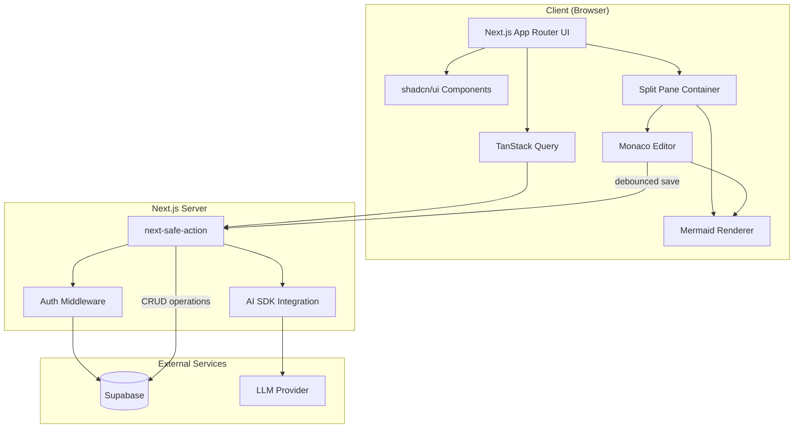
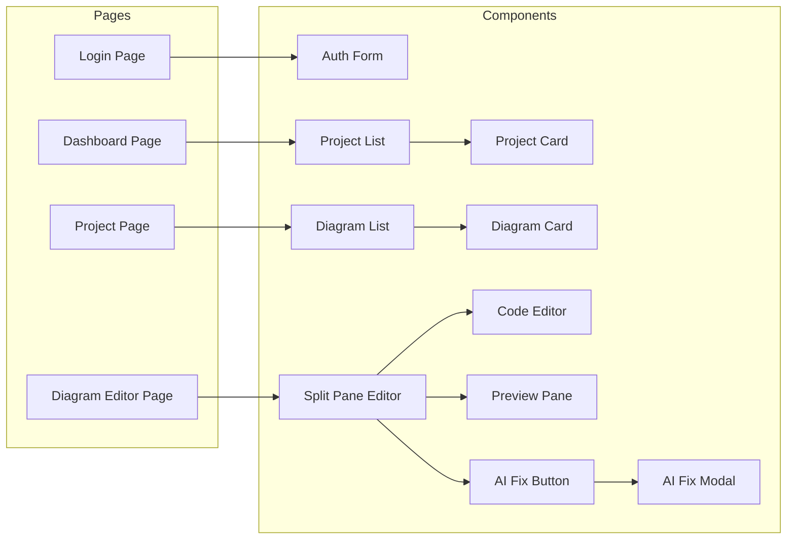

# Design Document: Mermaid Chart Preview Application

## Overview

The Mermaid Chart Preview Application is a Next.js-based web application that provides a real-time Mermaid diagram editing experience. The application uses a modern architecture with Supabase for authentication and data persistence, type-safe Server Actions via next-safe-action, and the Vercel AI SDK for intelligent syntax correction.

### Technology Stack

- **Framework**: Next.js (latest) with App Router
- **Package Manager**: pnpm
- **Styling**: Tailwind CSS
- **UI Components**: shadcn/ui
- **Data Fetching**: TanStack Query (React Query)
- **Server Actions**: next-safe-action (type-safe server actions with Zod validation)
- **Environment Variables**: @t3-oss/env-nextjs
- **Database & Auth**: Supabase
- **AI Integration**: Vercel AI SDK (@ai-sdk/google) with Gemini 2.0 Flash (gemini-2.0-flash-exp)
- **Code Editor**: Monaco Editor (@monaco-editor/react)
- **Diagram Rendering**: mermaid (with auto syntax error detection)
- **Diff View**: react-diff-viewer-continued (for highlighting code changes in AI fix modal)

The system follows a client-server architecture where:

- The frontend provides a responsive split-pane editor with live preview using shadcn/ui components
- Type-safe Server Actions (via next-safe-action) handle data mutations and AI interactions
- TanStack Query manages server state, caching, and data synchronization
- Supabase manages authentication, authorization, and data storage
- The AI SDK powers the syntax fixing feature through streaming responses

## Architecture



### Component Architecture



## Components and Interfaces

### Mermaid Syntax Error Detection & AI Fix

The application automatically detects Mermaid syntax errors during rendering and provides an AI-powered fix button.

**Flow:**

1. User types Mermaid code in the editor
2. `useMermaidRenderer` hook attempts to render the diagram
3. If Mermaid throws a syntax error, the error is captured
4. The error state triggers the "Fix with AI" button to appear
5. User clicks the button → AI analyzes the code using Gemini 2.0 Flash
6. AI returns fixed code + explanation
7. User can accept (replace code) or reject (keep original)

```typescript
// features/editor/hooks/use-mermaid-renderer.ts
interface UseMermaidRendererReturn {
  svg: string | null;
  error: string | null; // Captured Mermaid syntax error
  isRendering: boolean;
  hasError: boolean; // Boolean flag for error state
}

// features/editor/components/preview-pane.tsx
// Automatically detects errors from mermaid.parse() or mermaid.render()
// Displays error message and triggers AI fix button visibility

// features/editor/components/ai-fix-button.tsx
// Only visible when hasError === true
// Triggers AI fix action when clicked
```

### AI Fix Modal with Diff View

The AI fix modal displays a diff view comparing the original code with the AI-generated fix, highlighting changes for easy review.

```typescript
// features/editor/components/ai-fix-modal.tsx
'use client';

import { Dialog, DialogContent, DialogHeader, DialogTitle, DialogFooter } from '@/components/ui/dialog';
import { Button } from '@/components/ui/button';
import ReactDiffViewer, { DiffMethod } from 'react-diff-viewer-continued';

interface AIFixModalProps {
  isOpen: boolean;
  onClose: () => void;
  originalCode: string;
  fixedCode: string;
  explanation: string;
  onAccept: () => void;
  onReject: () => void;
}

export function AIFixModal({
  isOpen,
  onClose,
  originalCode,
  fixedCode,
  explanation,
  onAccept,
  onReject,
}: AIFixModalProps) {
  return (
    <Dialog open={isOpen} onOpenChange={onClose}>
      <DialogContent className="max-w-4xl max-h-[80vh] overflow-hidden flex flex-col">
        <DialogHeader>
          <DialogTitle>AI Suggested Fix</DialogTitle>
        </DialogHeader>

        {explanation && (
          <p className="text-sm text-muted-foreground mb-4">{explanation}</p>
        )}

        <div className="flex-1 overflow-auto border rounded-md">
          <ReactDiffViewer
            oldValue={originalCode}
            newValue={fixedCode}
            splitView={true}
            useDarkTheme={false}
            leftTitle="Original Code"
            rightTitle="Fixed Code"
            compareMethod={DiffMethod.LINES}
            styles={{
              variables: {
                light: {
                  diffViewerBackground: '#ffffff',
                  addedBackground: '#e6ffec',
                  addedColor: '#24292f',
                  removedBackground: '#ffebe9',
                  removedColor: '#24292f',
                  wordAddedBackground: '#abf2bc',
                  wordRemovedBackground: '#ff818266',
                },
              },
            }}
          />
        </div>

        <DialogFooter className="mt-4">
          <Button variant="outline" onClick={onReject}>
            Reject
          </Button>
          <Button onClick={onAccept}>
            Apply Fix
          </Button>
        </DialogFooter>
      </DialogContent>
    </Dialog>
  );
}
```

**Diff View Features:**

- Side-by-side comparison of original and fixed code
- Additions highlighted in green (#e6ffec background, #abf2bc for word-level)
- Deletions highlighted in red (#ffebe9 background, #ff818266 for word-level)
- Line-by-line diff comparison using `DiffMethod.LINES`
- Scrollable content for large code blocks
- Clear "Apply Fix" and "Reject" action buttons

### Environment Configuration

```typescript
// env.ts - using @t3-oss/env-nextjs
import { createEnv } from '@t3-oss/env-nextjs';
import { z } from 'zod';

export const env = createEnv({
  server: {
    SUPABASE_URL: z.string().url(),
    SUPABASE_SERVICE_ROLE_KEY: z.string().min(1),
    GOOGLE_GENERATIVE_AI_API_KEY: z.string().min(1),
  },
  client: {
    NEXT_PUBLIC_SUPABASE_URL: z.string().url(),
    NEXT_PUBLIC_SUPABASE_ANON_KEY: z.string().min(1),
  },
  runtimeEnv: {
    SUPABASE_URL: process.env.SUPABASE_URL,
    SUPABASE_SERVICE_ROLE_KEY: process.env.SUPABASE_SERVICE_ROLE_KEY,
    GOOGLE_GENERATIVE_AI_API_KEY: process.env.GOOGLE_GENERATIVE_AI_API_KEY,
    NEXT_PUBLIC_SUPABASE_URL: process.env.NEXT_PUBLIC_SUPABASE_URL,
    NEXT_PUBLIC_SUPABASE_ANON_KEY: process.env.NEXT_PUBLIC_SUPABASE_ANON_KEY,
  },
});
```

### Safe Action Client Setup

```typescript
// lib/safe-action.ts
import { createSafeActionClient } from 'next-safe-action';
import { createClient } from '@/lib/supabase/server';

export const actionClient = createSafeActionClient();

export const authActionClient = actionClient.use(async ({ next }) => {
  const supabase = await createClient();
  const {
    data: { user },
    error,
  } = await supabase.auth.getUser();

  if (error || !user) {
    throw new Error('Unauthorized');
  }

  return next({ ctx: { user, supabase } });
});
```

### Supabase Auth Configuration

To enable registration without email confirmation, configure Supabase Auth settings:

**Supabase Dashboard Configuration:**

1. Go to Authentication → Providers → Email
2. Disable "Confirm email" option

**Or via SQL (for local development):**

```sql
-- In supabase/config.toml or via dashboard
[auth]
enable_signup = true
enable_confirmations = false
```

This allows users to register and immediately access the application without waiting for email verification.

### Feature Structure Examples

#### Example 1: Projects Feature

```typescript
// features/projects/constants.ts
export const PROJECT_CONSTANTS = {
  MAX_NAME_LENGTH: 255,
  MIN_NAME_LENGTH: 1,
  DEFAULT_SORT: 'updated_at' as const,
  SORT_ORDER: 'desc' as const,
} as const;

// features/projects/types/project.types.ts
export interface Project {
  id: string;
  user_id: string;
  name: string;
  created_at: string;
  updated_at: string;
  diagram_count?: number;
}

export interface CreateProjectInput {
  name: string;
}

export interface UpdateProjectInput {
  id: string;
  name: string;
}

// features/projects/queries/projects.queries.ts
'use server';

import { createClient } from '@/lib/supabase/server';
import type { Project } from '../types/project.types';

export async function getProjects(): Promise<Project[]> {
  const supabase = await createClient();

  const { data, error } = await supabase
    .from('projects')
    .select('*, diagrams(count)')
    .order('updated_at', { ascending: false });

  if (error) throw error;
  return data;
}

export async function getProjectById(id: string): Promise<Project> {
  const supabase = await createClient();

  const { data, error } = await supabase
    .from('projects')
    .select('*, diagrams(count)')
    .eq('id', id)
    .single();

  if (error) throw error;
  return data;
}

// features/projects/actions/projects.actions.ts
'use server';

import { authActionClient } from '@/lib/safe-action';
import { z } from 'zod';
import { PROJECT_CONSTANTS } from '../constants';
import type { Project } from '../types/project.types';

const createProjectSchema = z.object({
  name: z
    .string()
    .min(PROJECT_CONSTANTS.MIN_NAME_LENGTH, 'Project name is required')
    .max(PROJECT_CONSTANTS.MAX_NAME_LENGTH, 'Project name too long')
    .trim(),
});

export const createProjectAction = authActionClient
  .schema(createProjectSchema)
  .action(async ({ parsedInput: { name }, ctx: { user, supabase } }) => {
    const { data, error } = await supabase
      .from('projects')
      .insert({ name, user_id: user.id })
      .select()
      .single();

    if (error) {
      return { success: false, error: error.message };
    }

    return { success: true, project: data as Project };
  });

const updateProjectSchema = z.object({
  id: z.string().uuid(),
  name: z
    .string()
    .min(PROJECT_CONSTANTS.MIN_NAME_LENGTH)
    .max(PROJECT_CONSTANTS.MAX_NAME_LENGTH)
    .trim(),
});

export const updateProjectAction = authActionClient
  .schema(updateProjectSchema)
  .action(async ({ parsedInput: { id, name }, ctx: { supabase } }) => {
    const { data, error } = await supabase
      .from('projects')
      .update({ name })
      .eq('id', id)
      .select()
      .single();

    if (error) {
      return { success: false, error: error.message };
    }

    return { success: true, project: data as Project };
  });

const deleteProjectSchema = z.object({
  id: z.string().uuid(),
});

export const deleteProjectAction = authActionClient
  .schema(deleteProjectSchema)
  .action(async ({ parsedInput: { id }, ctx: { supabase } }) => {
    const { error } = await supabase.from('projects').delete().eq('id', id);

    if (error) {
      return { success: false, error: error.message };
    }

    return { success: true };
  });

// features/projects/hooks/use-projects.ts
'use client';

import { useQuery, useQueryClient } from '@tanstack/react-query';
import { useAction } from 'next-safe-action/hooks';
import { getProjects } from '../queries/projects.queries';
import {
  createProjectAction,
  updateProjectAction,
  deleteProjectAction,
} from '../actions/projects.actions';
import type { Project, CreateProjectInput } from '../types/project.types';

export function useProjects() {
  return useQuery({
    queryKey: ['projects'],
    queryFn: getProjects,
  });
}

export function useCreateProject() {
  const queryClient = useQueryClient();
  const { execute, status, result } = useAction(createProjectAction, {
    onSuccess: () => {
      queryClient.invalidateQueries({ queryKey: ['projects'] });
    },
  });

  return {
    createProject: execute,
    isLoading: status === 'executing',
    result,
  };
}

export function useUpdateProject() {
  const queryClient = useQueryClient();
  const { execute, status, result } = useAction(updateProjectAction, {
    onSuccess: () => {
      queryClient.invalidateQueries({ queryKey: ['projects'] });
    },
  });

  return {
    updateProject: execute,
    isLoading: status === 'executing',
    result,
  };
}

export function useDeleteProject() {
  const queryClient = useQueryClient();
  const { execute, status, result } = useAction(deleteProjectAction, {
    onSuccess: () => {
      queryClient.invalidateQueries({ queryKey: ['projects'] });
    },
  });

  return {
    deleteProject: execute,
    isLoading: status === 'executing',
    result,
  };
}

// features/projects/components/project-list.tsx
'use client';

import { useProjects } from '../hooks/use-projects';
import { ProjectCard } from './project-card';
import type { Project } from '../types/project.types';

export function ProjectList() {
  const { data: projects, isLoading, error } = useProjects();

  if (isLoading) return <div>Loading projects...</div>;
  if (error) return <div>Error loading projects</div>;
  if (!projects?.length) return <div>No projects yet</div>;

  return (
    <div className="grid gap-4">
      {projects.map((project) => (
        <ProjectCard key={project.id} project={project} />
      ))}
    </div>
  );
}
```

#### Example 2: Editor Feature with AI Fix

````typescript
// features/editor/constants.ts
export const EDITOR_CONSTANTS = {
  DEBOUNCE_RENDER_MS: 500,
  AUTO_SAVE_DELAY_MS: 2000,
  DEFAULT_SPLIT_RATIO: 0.5,
  MAX_CODE_LENGTH: 100000,
} as const;

export const MERMAID_DEFAULT_TEMPLATE = `graph TD
    A[Start] --> B[End]`;

export const AI_FIX_SYSTEM_PROMPT = `You are a Mermaid diagram syntax expert. Your task is to fix syntax errors in Mermaid diagram code.

Rules:
1. Only fix syntax errors, don't change the diagram's structure or meaning
2. Preserve all node labels and connections
3. Return only the corrected Mermaid code
4. If you cannot fix the error, explain why

Common Mermaid syntax issues:
- Missing or incorrect arrow syntax (-->, ---, -.->)
- Unbalanced brackets or quotes
- Invalid node IDs (must start with letter, no spaces)
- Missing subgraph end statements
- Incorrect flowchart direction (TB, BT, LR, RL)`;

// features/editor/types/editor.types.ts
export interface MermaidRenderResult {
  svg: string | null;
  error: string | null;
  isRendering: boolean;
  hasError: boolean;
}

export interface AIFixResult {
  fixedCode: string;
  explanation: string;
}

export interface AutoSaveState {
  isSaving: boolean;
  lastSaved: Date | null;
  error: string | null;
}

// features/editor/actions/ai.actions.ts
'use server';

import { authActionClient } from '@/lib/safe-action';
import { z } from 'zod';
import { generateText } from 'ai';
import { google } from '@ai-sdk/google';
import { AI_FIX_SYSTEM_PROMPT } from '../constants';
import type { AIFixResult } from '../types/editor.types';

const fixSyntaxSchema = z.object({
  code: z.string(),
  errorMessage: z.string(),
});

export const fixMermaidSyntaxAction = authActionClient
  .schema(fixSyntaxSchema)
  .action(async ({ parsedInput: { code, errorMessage } }) => {
    const { text } = await generateText({
      model: google('gemini-2.0-flash-exp'),
      system: AI_FIX_SYSTEM_PROMPT,
      prompt: `Fix this Mermaid diagram code:\n\n\`\`\`mermaid\n${code}\n\`\`\`\n\nError message: ${errorMessage}`,
    });

    const codeMatch = text.match(/```mermaid\n([\s\S]*?)\n```/);
    const fixedCode = codeMatch ? codeMatch[1] : code;
    const explanation = text.replace(/```mermaid[\s\S]*?```/, '').trim();

    return {
      success: true,
      fixedCode,
      explanation
    } as { success: true } & AIFixResult;
  });

// features/editor/hooks/use-mermaid-renderer.ts
'use client';

import { useState, useEffect } from 'react';
import mermaid from 'mermaid';
import { EDITOR_CONSTANTS } from '../constants';
import type { MermaidRenderResult } from '../types/editor.types';

export function useMermaidRenderer(code: string): MermaidRenderResult {
  const [svg, setSvg] = useState<string | null>(null);
  const [error, setError] = useState<string | null>(null);
  const [isRendering, setIsRendering] = useState(false);

  useEffect(() => {
    const timer = setTimeout(async () => {
      if (!code.trim()) {
        setSvg(null);
        setError(null);
        return;
      }

      setIsRendering(true);
      setError(null);

      try {
        // Auto-detect syntax errors
        await mermaid.parse(code);
        const { svg: renderedSvg } = await mermaid.render('preview', code);
        setSvg(renderedSvg);
        setError(null);
      } catch (err) {
        // Capture Mermaid syntax error
        const errorMessage = err instanceof Error ? err.message : 'Unknown error';
        setError(errorMessage);
        setSvg(null);
      } finally {
        setIsRendering(false);
      }
    }, EDITOR_CONSTANTS.DEBOUNCE_RENDER_MS);

    return () => clearTimeout(timer);
  }, [code]);

  return {
    svg,
    error,
    isRendering,
    hasError: error !== null, // Flag for AI fix button visibility
  };
}

// features/editor/hooks/use-ai-fix.ts
'use client';

import { useAction } from 'next-safe-action/hooks';
import { fixMermaidSyntaxAction } from '../actions/ai.actions';

export function useAIFix() {
  const { execute, status, result, reset } = useAction(fixMermaidSyntaxAction);

  return {
    fixSyntax: execute,
    isLoading: status === 'executing',
    fixedCode: result?.data?.fixedCode,
    explanation: result?.data?.explanation,
    error: result?.serverError,
    reset,
  };
}

// features/editor/components/preview-pane.tsx
'use client';

import { useMermaidRenderer } from '../hooks/use-mermaid-renderer';

interface PreviewPaneProps {
  code: string;
  onError: (error: string | null) => void;
}

export function PreviewPane({ code, onError }: PreviewPaneProps) {
  const { svg, error, isRendering, hasError } = useMermaidRenderer(code);

  // Notify parent of error state for AI fix button
  useEffect(() => {
    onError(error);
  }, [error, onError]);

  if (isRendering) {
    return <div className="flex items-center justify-center h-full">Rendering...</div>;
  }

  if (hasError) {
    return (
      <div className="flex flex-col items-center justify-center h-full p-4">
        <p className="text-red-500 mb-2">Syntax Error</p>
        <p className="text-sm text-gray-600">{error}</p>
      </div>
    );
  }

  if (!svg) {
    return <div className="flex items-center justify-center h-full">Start typing...</div>;
  }

  return (
    <div
      className="w-full h-full overflow-auto p-4"
      dangerouslySetInnerHTML={{ __html: svg }}
    />
  );
}

// features/editor/components/ai-fix-button.tsx
'use client';

import { Button } from '@/components/ui/button';
import { Sparkles } from 'lucide-react';

interface AIFixButtonProps {
  visible: boolean;  // Only show when hasError === true
  onClick: () => void;
  isLoading: boolean;
}

export function AIFixButton({ visible, onClick, isLoading }: AIFixButtonProps) {
  if (!visible) return null;

  return (
    <Button
      onClick={onClick}
      disabled={isLoading}
      className="gap-2"
    >
      <Sparkles className="w-4 h-4" />
      {isLoading ? 'Fixing...' : 'Fix with AI'}
    </Button>
  );
}
````

#### Example 3: Diagrams Feature

```typescript
// features/diagrams/constants.ts
export const DIAGRAM_CONSTANTS = {
  MAX_NAME_LENGTH: 255,
  MIN_NAME_LENGTH: 1,
  MAX_CODE_LENGTH: 100000,
  DEFAULT_TEMPLATE: `graph TD
    A[Start] --> B[End]`,
} as const;

// features/diagrams/types/diagram.types.ts
export interface Diagram {
  id: string;
  project_id: string;
  name: string;
  code: string;
  created_at: string;
  updated_at: string;
}

export interface CreateDiagramInput {
  projectId: string;
  name: string;
}

export interface UpdateDiagramInput {
  id: string;
  name?: string;
  code?: string;
}

// features/diagrams/queries/diagrams.queries.ts
('use server');

import { createClient } from '@/lib/supabase/server';
import type { Diagram } from '../types/diagram.types';

export async function getDiagramsByProject(
  projectId: string,
): Promise<Diagram[]> {
  const supabase = await createClient();

  const { data, error } = await supabase
    .from('diagrams')
    .select('*')
    .eq('project_id', projectId)
    .order('updated_at', { ascending: false });

  if (error) throw error;
  return data;
}

export async function getDiagramById(id: string): Promise<Diagram> {
  const supabase = await createClient();

  const { data, error } = await supabase
    .from('diagrams')
    .select('*')
    .eq('id', id)
    .single();

  if (error) throw error;
  return data;
}

// features/diagrams/actions/diagrams.actions.ts
('use server');

import { authActionClient } from '@/lib/safe-action';
import { z } from 'zod';
import { DIAGRAM_CONSTANTS } from '../constants';
import type { Diagram } from '../types/diagram.types';

const createDiagramSchema = z.object({
  projectId: z.string().uuid(),
  name: z
    .string()
    .min(DIAGRAM_CONSTANTS.MIN_NAME_LENGTH, 'Diagram name is required')
    .max(DIAGRAM_CONSTANTS.MAX_NAME_LENGTH, 'Diagram name too long')
    .trim(),
});

export const createDiagramAction = authActionClient
  .schema(createDiagramSchema)
  .action(async ({ parsedInput: { projectId, name }, ctx: { supabase } }) => {
    const { data, error } = await supabase
      .from('diagrams')
      .insert({
        project_id: projectId,
        name,
        code: DIAGRAM_CONSTANTS.DEFAULT_TEMPLATE,
      })
      .select()
      .single();

    if (error) {
      return { success: false, error: error.message };
    }

    return { success: true, diagram: data as Diagram };
  });

const updateDiagramSchema = z.object({
  id: z.string().uuid(),
  name: z.string().min(1).max(255).trim().optional(),
  code: z.string().max(DIAGRAM_CONSTANTS.MAX_CODE_LENGTH).optional(),
});

export const updateDiagramAction = authActionClient
  .schema(updateDiagramSchema)
  .action(async ({ parsedInput: { id, ...updates }, ctx: { supabase } }) => {
    const { data, error } = await supabase
      .from('diagrams')
      .update(updates)
      .eq('id', id)
      .select()
      .single();

    if (error) {
      return { success: false, error: error.message };
    }

    return { success: true, diagram: data as Diagram };
  });

const deleteDiagramSchema = z.object({
  id: z.string().uuid(),
});

export const deleteDiagramAction = authActionClient
  .schema(deleteDiagramSchema)
  .action(async ({ parsedInput: { id }, ctx: { supabase } }) => {
    const { error } = await supabase.from('diagrams').delete().eq('id', id);

    if (error) {
      return { success: false, error: error.message };
    }

    return { success: true };
  });

// features/diagrams/hooks/use-diagrams.ts
('use client');

import { useQuery, useQueryClient } from '@tanstack/react-query';
import { useAction } from 'next-safe-action/hooks';
import {
  getDiagramsByProject,
  getDiagramById,
} from '../queries/diagrams.queries';
import {
  createDiagramAction,
  updateDiagramAction,
  deleteDiagramAction,
} from '../actions/diagrams.actions';

export function useDiagrams(projectId: string) {
  return useQuery({
    queryKey: ['diagrams', projectId],
    queryFn: () => getDiagramsByProject(projectId),
    enabled: !!projectId,
  });
}

export function useDiagram(id: string) {
  return useQuery({
    queryKey: ['diagram', id],
    queryFn: () => getDiagramById(id),
    enabled: !!id,
  });
}

export function useCreateDiagram() {
  const queryClient = useQueryClient();
  const { execute, status, result } = useAction(createDiagramAction, {
    onSuccess: (data) => {
      if (data?.diagram) {
        queryClient.invalidateQueries({
          queryKey: ['diagrams', data.diagram.project_id],
        });
      }
    },
  });

  return {
    createDiagram: execute,
    isLoading: status === 'executing',
    result,
  };
}

export function useUpdateDiagram() {
  const queryClient = useQueryClient();
  const { execute, status, result } = useAction(updateDiagramAction, {
    onSuccess: (data) => {
      if (data?.diagram) {
        queryClient.invalidateQueries({
          queryKey: ['diagram', data.diagram.id],
        });
        queryClient.invalidateQueries({
          queryKey: ['diagrams', data.diagram.project_id],
        });
      }
    },
  });

  return {
    updateDiagram: execute,
    isLoading: status === 'executing',
    result,
  };
}
```

### React Components (using shadcn/ui)

```typescript
// components/ui - shadcn/ui components
// Install via: pnpm dlx shadcn@latest add button card dialog input form toast

// components/split-pane-editor.tsx
interface SplitPaneEditorProps {
  diagram: Diagram;
  onCodeChange: (code: string) => void;
  onSave: () => void;
}

// components/code-editor.tsx
interface CodeEditorProps {
  value: string;
  onChange: (value: string) => void;
  onError?: (error: string | null) => void;
}

// components/preview-pane.tsx
interface PreviewPaneProps {
  code: string;
  onRenderError: (error: string | null) => void;
}

// components/ai-fix-button.tsx
interface AIFixButtonProps {
  code: string;
  errorMessage: string;
  onFixApplied: (fixedCode: string) => void;
  disabled?: boolean;
}

// components/ai-fix-modal.tsx (using shadcn Dialog + react-diff-viewer-continued)
interface AIFixModalProps {
  isOpen: boolean;
  onClose: () => void;
  originalCode: string;
  fixedCode: string;
  explanation: string;
  onAccept: () => void;
  onReject: () => void;
}

// The modal displays a diff view with:
// - Additions highlighted in green
// - Deletions highlighted in red
// - Side-by-side or unified view option
// - Accept/Reject buttons at the bottom

// components/project-list.tsx
interface ProjectListProps {
  projects: Project[];
  onProjectClick: (project: Project) => void;
  onProjectDelete: (projectId: string) => void;
}

// components/diagram-list.tsx
interface DiagramListProps {
  diagrams: Diagram[];
  onDiagramClick: (diagram: Diagram) => void;
  onDiagramDelete: (diagramId: string) => void;
}

// components/project-card.tsx (using shadcn Card)
interface ProjectCardProps {
  project: Project;
  onClick: () => void;
  onDelete: () => void;
}

// components/create-project-dialog.tsx (using shadcn Dialog + Form)
interface CreateProjectDialogProps {
  open: boolean;
  onOpenChange: (open: boolean) => void;
  onSuccess: () => void;
}

// components/create-diagram-dialog.tsx
interface CreateDiagramDialogProps {
  projectId: string;
  open: boolean;
  onOpenChange: (open: boolean) => void;
  onSuccess: () => void;
}

// components/confirm-dialog.tsx (using shadcn AlertDialog)
interface ConfirmDialogProps {
  open: boolean;
  onOpenChange: (open: boolean) => void;
  title: string;
  description: string;
  onConfirm: () => void;
  isLoading?: boolean;
}

// components/breadcrumb-nav.tsx
interface BreadcrumbNavProps {
  items: Array<{
    label: string;
    href?: string;
  }>;
}
```

## Data Models

### Database Schema (Supabase)

```sql
-- Users table (managed by Supabase Auth)
-- Supabase automatically creates auth.users

-- Projects table
CREATE TABLE projects (
  id UUID PRIMARY KEY DEFAULT gen_random_uuid(),
  user_id UUID NOT NULL REFERENCES auth.users(id) ON DELETE CASCADE,
  name VARCHAR(255) NOT NULL,
  created_at TIMESTAMP WITH TIME ZONE DEFAULT NOW(),
  updated_at TIMESTAMP WITH TIME ZONE DEFAULT NOW()
);

-- Diagrams table
CREATE TABLE diagrams (
  id UUID PRIMARY KEY DEFAULT gen_random_uuid(),
  project_id UUID NOT NULL REFERENCES projects(id) ON DELETE CASCADE,
  name VARCHAR(255) NOT NULL,
  code TEXT NOT NULL DEFAULT 'graph TD\n    A[Start] --> B[End]',
  created_at TIMESTAMP WITH TIME ZONE DEFAULT NOW(),
  updated_at TIMESTAMP WITH TIME ZONE DEFAULT NOW()
);

-- Row Level Security Policies
ALTER TABLE projects ENABLE ROW LEVEL SECURITY;
ALTER TABLE diagrams ENABLE ROW LEVEL SECURITY;

-- Projects: Users can only access their own projects
CREATE POLICY "Users can view own projects" ON projects
  FOR SELECT USING (auth.uid() = user_id);

CREATE POLICY "Users can create own projects" ON projects
  FOR INSERT WITH CHECK (auth.uid() = user_id);

CREATE POLICY "Users can update own projects" ON projects
  FOR UPDATE USING (auth.uid() = user_id);

CREATE POLICY "Users can delete own projects" ON projects
  FOR DELETE USING (auth.uid() = user_id);

-- Diagrams: Users can access diagrams in their projects
CREATE POLICY "Users can view diagrams in own projects" ON diagrams
  FOR SELECT USING (
    EXISTS (
      SELECT 1 FROM projects
      WHERE projects.id = diagrams.project_id
      AND projects.user_id = auth.uid()
    )
  );

CREATE POLICY "Users can create diagrams in own projects" ON diagrams
  FOR INSERT WITH CHECK (
    EXISTS (
      SELECT 1 FROM projects
      WHERE projects.id = diagrams.project_id
      AND projects.user_id = auth.uid()
    )
  );

CREATE POLICY "Users can update diagrams in own projects" ON diagrams
  FOR UPDATE USING (
    EXISTS (
      SELECT 1 FROM projects
      WHERE projects.id = diagrams.project_id
      AND projects.user_id = auth.uid()
    )
  );

CREATE POLICY "Users can delete diagrams in own projects" ON diagrams
  FOR DELETE USING (
    EXISTS (
      SELECT 1 FROM projects
      WHERE projects.id = diagrams.project_id
      AND projects.user_id = auth.uid()
    )
  );

-- Indexes for performance
CREATE INDEX idx_projects_user_id ON projects(user_id);
CREATE INDEX idx_projects_updated_at ON projects(updated_at DESC);
CREATE INDEX idx_diagrams_project_id ON diagrams(project_id);
CREATE INDEX idx_diagrams_updated_at ON diagrams(updated_at DESC);

-- Trigger to update updated_at
CREATE OR REPLACE FUNCTION update_updated_at()
RETURNS TRIGGER AS $$
BEGIN
  NEW.updated_at = NOW();
  RETURN NEW;
END;
$$ LANGUAGE plpgsql;

CREATE TRIGGER projects_updated_at
  BEFORE UPDATE ON projects
  FOR EACH ROW EXECUTE FUNCTION update_updated_at();

CREATE TRIGGER diagrams_updated_at
  BEFORE UPDATE ON diagrams
  FOR EACH ROW EXECUTE FUNCTION update_updated_at();
```

### TypeScript Types

```typescript
// types/database.ts
interface User {
  id: string;
  email: string;
  created_at: string;
}

interface Project {
  id: string;
  user_id: string;
  name: string;
  created_at: string;
  updated_at: string;
  diagram_count?: number; // computed field
}

interface Diagram {
  id: string;
  project_id: string;
  name: string;
  code: string;
  created_at: string;
  updated_at: string;
}

// Validation schemas using Zod
import { z } from 'zod';

const ProjectNameSchema = z
  .string()
  .min(1, 'Project name is required')
  .max(255, 'Project name must be less than 255 characters')
  .trim();

const DiagramNameSchema = z
  .string()
  .min(1, 'Diagram name is required')
  .max(255, 'Diagram name must be less than 255 characters')
  .trim();

const DiagramCodeSchema = z
  .string()
  .max(100000, 'Diagram code must be less than 100,000 characters');
```

### Query Client Provider

```typescript
// providers/query-provider.tsx
"use client";

import { QueryClient, QueryClientProvider } from "@tanstack/react-query";
import { useState } from "react";

export function QueryProvider({ children }: { children: React.ReactNode }) {
  const [queryClient] = useState(
    () =>
      new QueryClient({
        defaultOptions: {
          queries: {
            staleTime: 60 * 1000, // 1 minute
            refetchOnWindowFocus: false,
          },
        },
      })
  );

  return (
    <QueryClientProvider client={queryClient}>{children}</QueryClientProvider>
  );
}
```

## Correctness Properties

_A property is a characteristic or behavior that should hold true across all valid executions of a system—essentially, a formal statement about what the system should do. Properties serve as the bridge between human-readable specifications and machine-verifiable correctness guarantees._

Based on the prework analysis, the following correctness properties have been identified:

### Property 1: Protected Route Redirection

_For any_ unauthenticated request to a protected route (dashboard, project, diagram editor), the system should redirect to the login page.

**Validates: Requirements 1.1**

### Property 2: Valid Project Creation

_For any_ valid project name (non-empty, non-whitespace, ≤255 characters), creating a project should succeed and the project should appear in the user's project list.

**Validates: Requirements 2.2**

### Property 3: Name Validation Rejects Invalid Input

_For any_ empty string or whitespace-only string submitted as a project name or diagram name, the system should reject the input and display a validation error.

**Validates: Requirements 2.3, 3.3**

### Property 4: Cascade Deletion

_For any_ project with associated diagrams, deleting the project should remove the project and all its diagrams from the database.

**Validates: Requirements 2.6**

### Property 5: Project Update Persistence

_For any_ valid project name update, the change should persist to the database and be reflected when the project is retrieved.

**Validates: Requirements 2.7**

### Property 6: List Sorting by Updated Date

_For any_ list of projects or diagrams, the items should be sorted by their `updated_at` timestamp in descending order (most recent first).

**Validates: Requirements 2.8, 3.8**

### Property 7: New Diagram Default Template

_For any_ newly created diagram, the code field should contain the default Mermaid template code.

**Validates: Requirements 3.1**

### Property 8: Valid Diagram Creation

_For any_ valid diagram name (non-empty, non-whitespace, ≤255 characters) within a project, creating a diagram should succeed and the diagram should appear in the project's diagram list.

**Validates: Requirements 3.2**

### Property 9: Diagram Deletion

_For any_ diagram, after deletion the diagram should not appear in the project's diagram list.

**Validates: Requirements 3.6**

### Property 10: Diagram Name Update Persistence

_For any_ valid diagram name update, the change should persist to the database and be reflected when the diagram is retrieved.

**Validates: Requirements 3.7**

### Property 11: Debounced Preview Update

_For any_ code change in the editor, the preview should update within 500ms after the last keystroke (debounce behavior).

**Validates: Requirements 4.2**

### Property 12: Valid Mermaid Rendering

_For any_ valid Mermaid syntax, the renderer should produce an SVG output without errors.

**Validates: Requirements 4.3**

### Property 13: Invalid Mermaid Error Handling

_For any_ invalid Mermaid syntax, the renderer should return an error message without throwing an unhandled exception.

**Validates: Requirements 4.4**

### Property 14: Auto-Save Persistence

_For any_ code modification in the editor, after the auto-save delay (2 seconds of inactivity), the changes should be persisted to the database.

**Validates: Requirements 4.6**

### Property 15: AI Fix Button Visibility

_For any_ invalid Mermaid syntax in the editor, the "Fix with AI" button should be visible.

**Validates: Requirements 5.1**

### Property 15.1: AI Fix Diff View Highlighting

_For any_ AI-generated fix displayed in the modal, the diff view should highlight additions in green and deletions in red, clearly showing the differences between original and fixed code.

**Validates: Requirements 5.3**

### Property 16: AI Fix Accept Updates Editor

_For any_ AI-generated fix that is accepted by the user, the editor content should be replaced with the fixed code.

**Validates: Requirements 5.4**

### Property 17: AI Fix Reject Preserves Original

_For any_ AI-generated fix that is rejected by the user, the editor content should remain unchanged from the original code.

**Validates: Requirements 5.5**

### Property 18: Diagram Code Round-Trip Persistence

_For any_ diagram code, saving and then loading the diagram should return the same code content.

**Validates: Requirements 6.1, 6.2**

### Property 19: Unique Diagram Identifiers

_For any_ set of created diagrams, all diagram IDs should be unique.

**Validates: Requirements 6.3**

### Property 20: Diagram Metadata Completeness

_For any_ diagram, the stored record should include creation date, last modified date, and be associated with the correct project.

**Validates: Requirements 6.5**

### Property 21: Project Card Information Completeness

_For any_ project displayed in the dashboard, the project card should show the project name, diagram count, and last modified date.

**Validates: Requirements 7.5**

## Error Handling

### Authentication Errors

| Error Scenario              | Handling Strategy                                |
| --------------------------- | ------------------------------------------------ |
| Invalid credentials         | Display error message, remain on login page      |
| Session expired             | Redirect to login with "session expired" message |
| Network failure during auth | Display retry option with error message          |
| Email already registered    | Display specific error during signup             |

### Data Operation Errors

| Error Scenario         | Handling Strategy                                                     |
| ---------------------- | --------------------------------------------------------------------- |
| Project creation fails | Display error toast, retain form data                                 |
| Diagram save fails     | Display error notification, enable manual retry, queue for auto-retry |
| Delete operation fails | Display error toast, revert optimistic UI update                      |
| Network timeout        | Display timeout message with retry option                             |

### Mermaid Rendering Errors

| Error Scenario       | Handling Strategy                                                |
| -------------------- | ---------------------------------------------------------------- |
| Invalid syntax       | Display error message in preview pane, show "Fix with AI" button |
| Rendering timeout    | Display timeout message, suggest simplifying diagram             |
| Unknown diagram type | Display supported types list                                     |

### AI Service Errors

| Error Scenario          | Handling Strategy                          |
| ----------------------- | ------------------------------------------ |
| AI service unavailable  | Display error message, suggest manual fix  |
| Rate limit exceeded     | Display rate limit message with retry time |
| Invalid response format | Log error, display generic error to user   |
| Timeout                 | Display timeout message with retry option  |

### Error Response Format

```typescript
interface ErrorResponse {
  success: false;
  error: {
    code: string;
    message: string;
    details?: Record<string, unknown>;
  };
}

// Error codes
const ErrorCodes = {
  // Auth errors
  AUTH_INVALID_CREDENTIALS: 'AUTH_INVALID_CREDENTIALS',
  AUTH_SESSION_EXPIRED: 'AUTH_SESSION_EXPIRED',
  AUTH_EMAIL_EXISTS: 'AUTH_EMAIL_EXISTS',

  // Validation errors
  VALIDATION_EMPTY_NAME: 'VALIDATION_EMPTY_NAME',
  VALIDATION_NAME_TOO_LONG: 'VALIDATION_NAME_TOO_LONG',

  // Data errors
  PROJECT_NOT_FOUND: 'PROJECT_NOT_FOUND',
  DIAGRAM_NOT_FOUND: 'DIAGRAM_NOT_FOUND',
  SAVE_FAILED: 'SAVE_FAILED',

  // AI errors
  AI_SERVICE_UNAVAILABLE: 'AI_SERVICE_UNAVAILABLE',
  AI_RATE_LIMITED: 'AI_RATE_LIMITED',
  AI_INVALID_RESPONSE: 'AI_INVALID_RESPONSE',

  // Rendering errors
  MERMAID_SYNTAX_ERROR: 'MERMAID_SYNTAX_ERROR',
  MERMAID_RENDER_TIMEOUT: 'MERMAID_RENDER_TIMEOUT',
} as const;
```

## Testing Strategy

### Dual Testing Approach

This application requires both unit tests and property-based tests for comprehensive coverage:

- **Unit tests**: Verify specific examples, edge cases, integration points, and error conditions
- **Property tests**: Verify universal properties across randomly generated inputs

### Property-Based Testing Configuration

- **Library**: fast-check (TypeScript property-based testing library)
- **Minimum iterations**: 100 per property test
- **Tag format**: `Feature: mermaid-preview-app, Property {number}: {property_text}`

### Test Categories

#### Unit Tests

1. **Component Tests**
   - Auth form submission handling
   - Project/Diagram CRUD UI interactions
   - Split pane resizing behavior
   - AI fix modal accept/reject flows

2. **Server Action Tests**
   - Authentication flows (login, signup, logout)
   - Project CRUD operations
   - Diagram CRUD operations
   - AI syntax fixing

3. **Hook Tests**
   - useAutoSave debounce behavior
   - useMermaidRenderer error handling
   - useSplitPane drag interactions

4. **Integration Tests**
   - End-to-end authentication flow
   - Project → Diagram navigation
   - Editor → Preview → Save flow

#### Property-Based Tests

Each correctness property from the design should be implemented as a property-based test:

1. **Property 3**: Name validation - Generate random whitespace strings, verify rejection
2. **Property 6**: List sorting - Generate random lists, verify sort order
3. **Property 12**: Valid Mermaid rendering - Generate valid Mermaid syntax, verify SVG output
4. **Property 13**: Invalid Mermaid handling - Generate invalid syntax, verify error without crash
5. **Property 18**: Round-trip persistence - Generate random code, save/load, verify equality
6. **Property 19**: Unique IDs - Create multiple diagrams, verify all IDs unique

### Test File Structure

```
__tests__/
├── unit/
│   ├── components/
│   │   ├── auth-form.test.tsx
│   │   ├── project-list.test.tsx
│   │   ├── diagram-list.test.tsx
│   │   ├── split-pane-editor.test.tsx
│   │   ├── code-editor.test.tsx
│   │   ├── preview-pane.test.tsx
│   │   └── ai-fix-modal.test.tsx
│   ├── actions/
│   │   ├── auth.test.ts
│   │   ├── projects.test.ts
│   │   ├── diagrams.test.ts
│   │   └── ai.test.ts
│   └── hooks/
│       ├── use-auto-save.test.ts
│       ├── use-mermaid-renderer.test.ts
│       └── use-split-pane.test.ts
├── property/
│   ├── validation.property.test.ts
│   ├── sorting.property.test.ts
│   ├── mermaid-rendering.property.test.ts
│   └── persistence.property.test.ts
└── integration/
    ├── auth-flow.test.ts
    ├── project-management.test.ts
    └── diagram-editing.test.ts
```

### Mocking Strategy

- **Supabase**: Mock Supabase client for unit tests, use test database for integration
- **AI SDK**: Mock generateText for unit tests, use real API for integration (with rate limiting)
- **Mermaid**: Use actual mermaid library for rendering tests
- **next-safe-action**: Mock action responses for component tests

### Project Structure (Feature-Based Organization)

```
mermaid-preview-app/
├── src/
│   ├── app/
│   │   ├── (auth)/
│   │   │   ├── login/
│   │   │   │   └── page.tsx
│   │   │   └── signup/
│   │   │       └── page.tsx
│   │   ├── (dashboard)/
│   │   │   ├── layout.tsx
│   │   │   ├── page.tsx                    # Dashboard with project list
│   │   │   ├── projects/
│   │   │   │   └── [projectId]/
│   │   │   │       ├── page.tsx            # Project view with diagram list
│   │   │   │       └── diagrams/
│   │   │   │           └── [diagramId]/
│   │   │   │               └── page.tsx    # Diagram editor
│   │   │   └── settings/
│   │   │       └── page.tsx
│   │   ├── layout.tsx
│   │   └── globals.css
│   ├── features/
│   │   ├── auth/
│   │   │   ├── components/
│   │   │   │   └── auth-form.tsx           # UI component
│   │   │   ├── hooks/
│   │   │   │   └── use-auth-form.ts        # Business logic for auth form
│   │   │   ├── actions/
│   │   │   │   └── auth.actions.ts         # Server actions
│   │   │   ├── queries/
│   │   │   │   └── auth.queries.ts         # Supabase queries (server-side)
│   │   │   ├── types/
│   │   │   │   └── auth.types.ts           # TypeScript types
│   │   │   └── constants.ts                # Auth constants
│   │   ├── projects/
│   │   │   ├── components/
│   │   │   │   ├── project-list.tsx
│   │   │   │   ├── project-card.tsx
│   │   │   │   └── create-project-dialog.tsx
│   │   │   ├── hooks/
│   │   │   │   ├── use-projects.ts         # Business logic for project list
│   │   │   │   ├── use-create-project.ts   # Business logic for creation
│   │   │   │   └── use-delete-project.ts   # Business logic for deletion
│   │   │   ├── actions/
│   │   │   │   └── projects.actions.ts     # Server actions (CRUD)
│   │   │   ├── queries/
│   │   │   │   └── projects.queries.ts     # Supabase queries (server-side)
│   │   │   ├── types/
│   │   │   │   └── project.types.ts        # TypeScript types
│   │   │   └── constants.ts                # Project constants
│   │   ├── diagrams/
│   │   │   ├── components/
│   │   │   │   ├── diagram-list.tsx
│   │   │   │   ├── diagram-card.tsx
│   │   │   │   └── create-diagram-dialog.tsx
│   │   │   ├── hooks/
│   │   │   │   ├── use-diagrams.ts         # Business logic for diagram list
│   │   │   │   ├── use-create-diagram.ts   # Business logic for creation
│   │   │   │   └── use-delete-diagram.ts   # Business logic for deletion
│   │   │   ├── actions/
│   │   │   │   └── diagrams.actions.ts     # Server actions (CRUD)
│   │   │   ├── queries/
│   │   │   │   └── diagrams.queries.ts     # Supabase queries (server-side)
│   │   │   ├── types/
│   │   │   │   └── diagram.types.ts        # TypeScript types
│   │   │   └── constants.ts                # Diagram constants (default template)
│   │   ├── editor/
│   │   │   ├── components/
│   │   │   │   ├── split-pane-editor.tsx
│   │   │   │   ├── code-editor.tsx
│   │   │   │   ├── preview-pane.tsx
│   │   │   │   ├── ai-fix-button.tsx       # Shows when syntax error detected
│   │   │   │   └── ai-fix-modal.tsx
│   │   │   ├── hooks/
│   │   │   │   ├── use-auto-save.ts        # Auto-save business logic
│   │   │   │   ├── use-mermaid-renderer.ts # Mermaid rendering + error detection
│   │   │   │   ├── use-split-pane.ts       # Split pane resize logic
│   │   │   │   └── use-ai-fix.ts           # AI fix business logic
│   │   │   ├── actions/
│   │   │   │   └── ai.actions.ts           # AI fix server action (Gemini)
│   │   │   ├── queries/
│   │   │   │   └── editor.queries.ts       # Editor-related queries (if needed)
│   │   │   ├── types/
│   │   │   │   └── editor.types.ts         # Editor types
│   │   │   ├── constants.ts                # Editor constants (debounce times, etc.)
│   │   │   └── lib/
│   │   │       └── mermaid-config.ts       # Mermaid configuration
│   │   └── navigation/
│   │       ├── components/
│   │       │   └── breadcrumb-nav.tsx
│   │       ├── hooks/
│   │       │   └── use-breadcrumbs.ts      # Breadcrumb business logic
│   │       ├── types/
│   │       │   └── navigation.types.ts
│   │       └── constants.ts
│   ├── components/
│   │   ├── ui/                             # shadcn/ui components
│   │   │   ├── button.tsx
│   │   │   ├── card.tsx
│   │   │   ├── dialog.tsx
│   │   │   ├── form.tsx
│   │   │   ├── input.tsx
│   │   │   ├── toast.tsx
│   │   │   └── alert-dialog.tsx
│   │   └── shared/
│   │       └── confirm-dialog.tsx
│   ├── lib/
│   │   ├── safe-action.ts
│   │   ├── ai.ts
│   │   └── supabase/
│   │       ├── client.ts
│   │       ├── server.ts
│   │       └── middleware.ts
│   ├── providers/
│   │   └── query-provider.tsx
│   ├── types/
│   │   └── database.ts                     # Global database types
│   ├── env.ts
│   └── middleware.ts
├── supabase/
│   └── migrations/
│       └── 001_initial_schema.sql
├── __tests__/
│   ├── unit/
│   │   ├── features/
│   │   │   ├── auth/
│   │   │   ├── projects/
│   │   │   ├── diagrams/
│   │   │   └── editor/
│   │   └── lib/
│   ├── property/
│   │   ├── validation.property.test.ts
│   │   ├── sorting.property.test.ts
│   │   ├── mermaid-rendering.property.test.ts
│   │   └── persistence.property.test.ts
│   └── integration/
│       ├── auth-flow.test.ts
│       ├── project-management.test.ts
│       └── diagram-editing.test.ts
├── package.json
├── pnpm-lock.yaml
├── tailwind.config.ts
├── tsconfig.json
└── components.json                         # shadcn/ui config
```

### Feature Structure Pattern

Each feature follows this consistent structure:

```
features/{feature-name}/
├── components/          # UI components (presentation layer)
├── hooks/              # Custom hooks (business logic layer)
├── actions/            # Server actions (*.actions.ts)
├── queries/            # Supabase queries - server-side only (*.queries.ts)
├── types/              # TypeScript types (*.types.ts)
└── constants.ts        # Feature constants
```

### Feature Organization Benefits

1. **Colocation**: Related code (components, actions, hooks, types) lives together
2. **Scalability**: Easy to add new features without cluttering root directories
3. **Maintainability**: Clear boundaries between features
4. **Discoverability**: Developers can quickly find feature-specific code
5. **Testing**: Test files mirror the feature structure
6. **Separation of Concerns**:
   - Components handle UI rendering
   - Hooks handle business logic
   - Actions handle server-side mutations
   - Queries handle server-side data fetching
   - Types provide type safety
   - Constants centralize configuration
